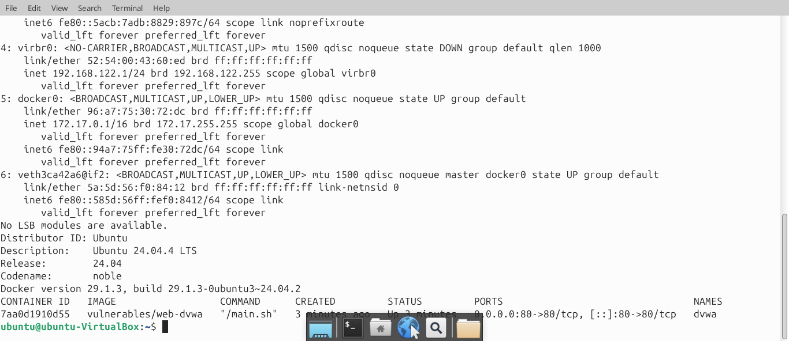
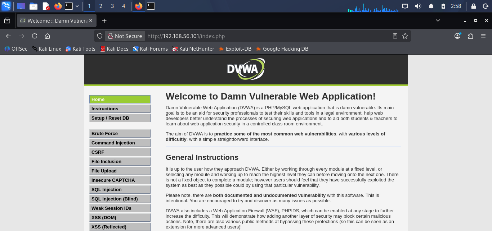
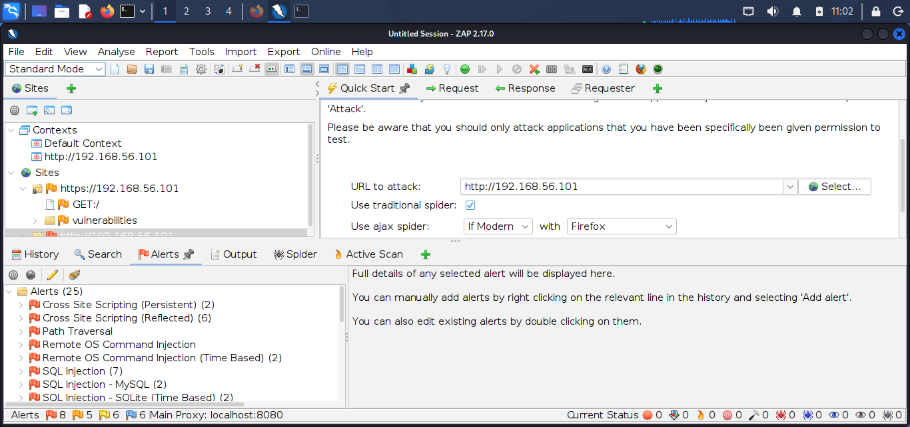
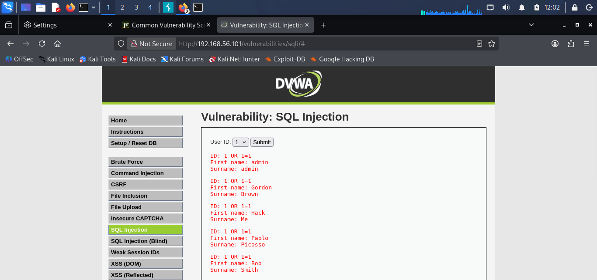
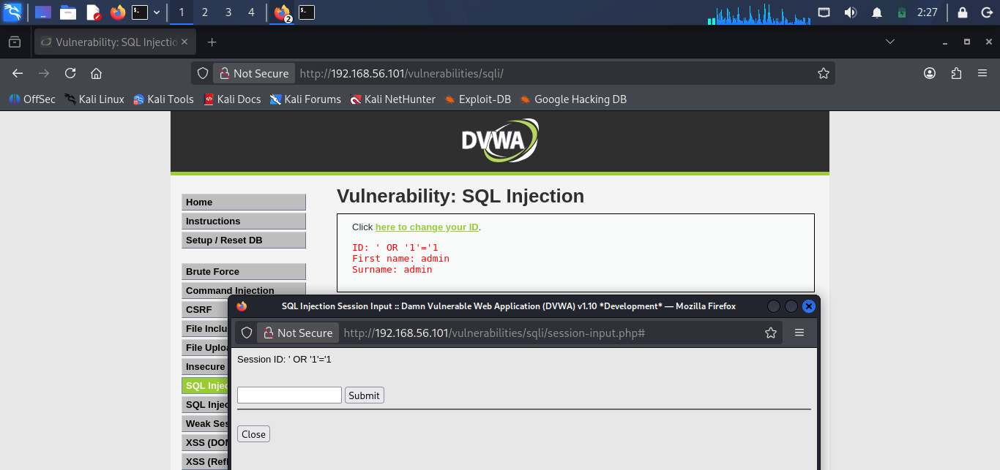
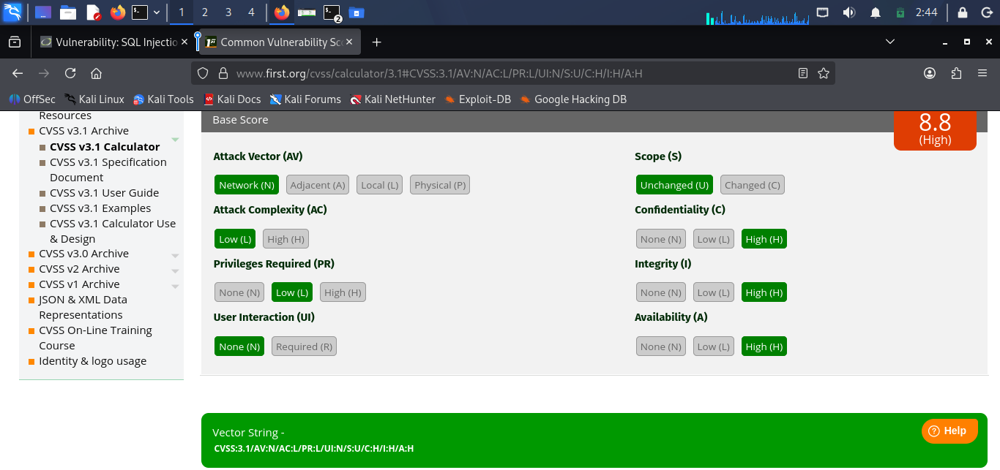
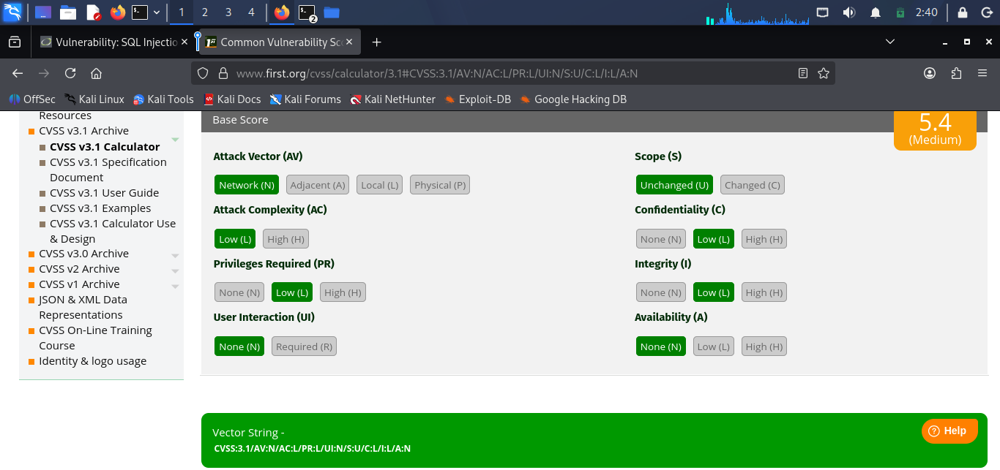
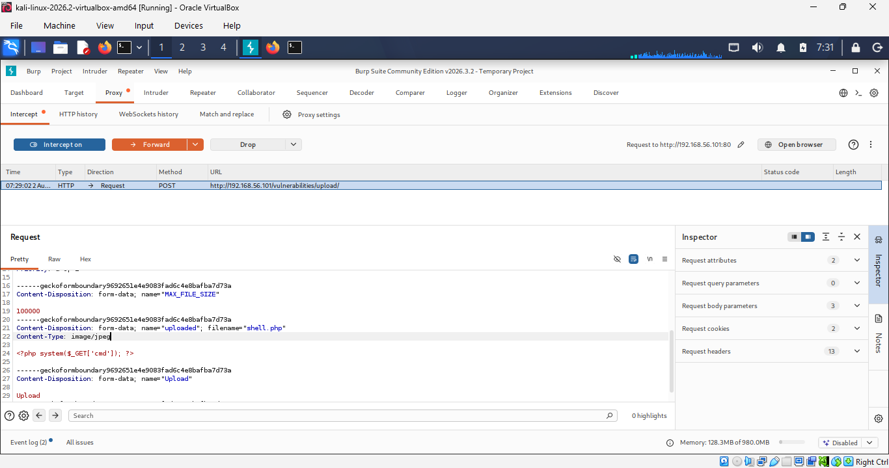
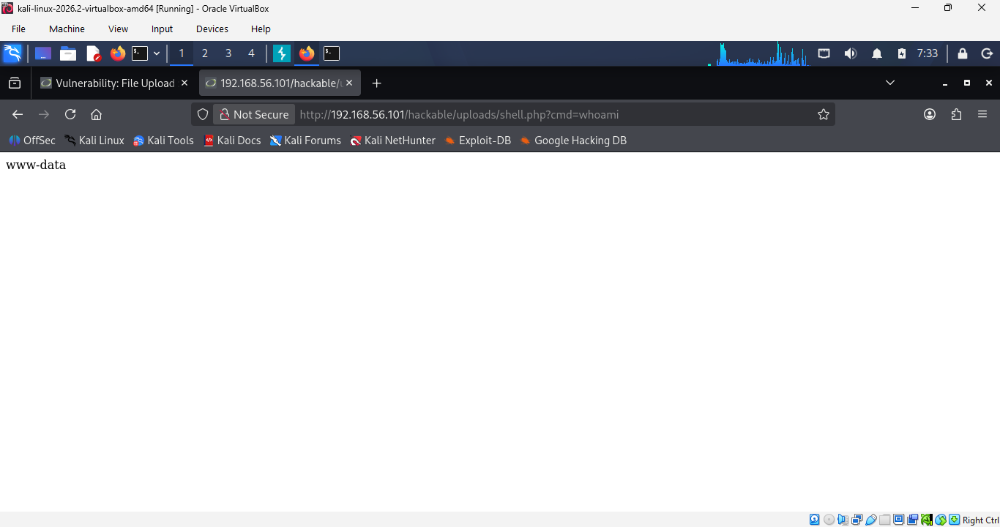
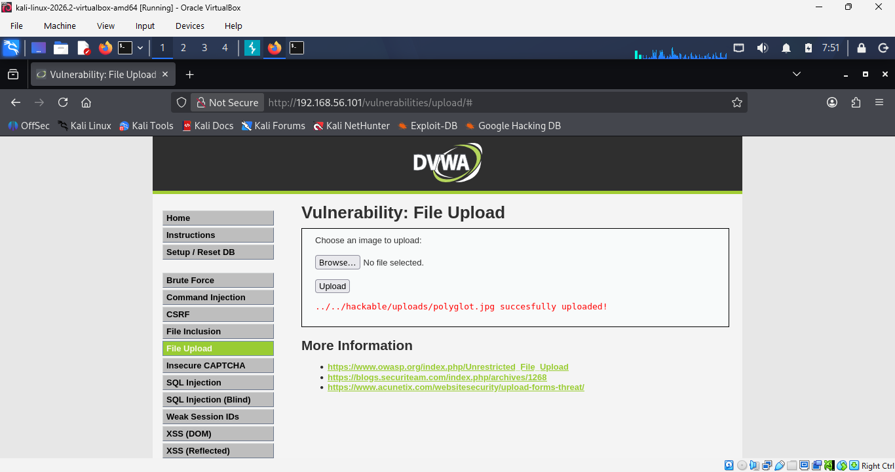

# DVWA Security Assessment — VAPT, Risk Register & Compliance Mapping

> A full-scope web application penetration test against DVWA across all three built-in security levels (Low, Medium, High), showing not just that each vulnerability exists, but *why* each level's mitigation does or doesn't hold up under a working bypass — then translating every technical finding into CVSS scoring and governance-language mappings across ISO/IEC 27001:2022, NIST CSF 2.0, and PCI DSS 4.0.

**Full write-up:** [report.md](report.md) — all 10 findings in full detail (root-cause source code, every bypass payload, and evidence) plus the complete risk register and compliance mapping. This README is a condensed summary of the same assessment.

## Contents

- [Objective](#objective)
- [Scope & Rules of Engagement](#scope--rules-of-engagement)
- [Environment](#environment)
- [Methodology](#methodology)
- [Automated Scan Summary (OWASP ZAP)](#automated-scan-summary-owasp-zap)
- [Key Findings](#key-findings)
- [Finding Deep-Dive: SQL Injection](#finding-deep-dive-sql-injection)
- [Finding Deep-Dive: Unrestricted File Upload](#finding-deep-dive-unrestricted-file-upload)
- [Compliance Mapping](#compliance-mapping)
- [Remediation Plan](#remediation-plan)
- [Repository Structure](#repository-structure)
- [Learning Outcomes](#learning-outcomes)
- [Disclaimer](#disclaimer)

## Objective

Evaluate the security posture of DVWA (Damn Vulnerable Web Application) using a combined automated and manual methodology across all three difficulty levels, to demonstrate a pattern that recurs constantly in real applications: escalating "security levels" or interim patches often narrow the *technique* required for exploitation without fixing the *root cause*.

10 findings were fully investigated, tested at every applicable security level, and documented with evidence, root-cause analysis, CVSS v3.1 scoring, and mapping to OWASP Top 10 (2021), CWE, ISO/IEC 27001:2022, NIST CSF 2.0, and PCI DSS 4.0.

**Overall Risk Rating: Critical** — three independent findings (SQL Injection, OS Command Injection, Unrestricted File Upload) each provide a standalone path to full database or host compromise, confirmed with working, reproducible proof-of-concept evidence.

## Scope & Rules of Engagement

| Item | Detail |
|---|---|
| Target | DVWA v1.10 Development, hosted in Docker (`vulnerables/web-dvwa`) on Ubuntu 24.04.4 LTS |
| Analyst machine | Kali Linux |
| Security levels tested | Low, Medium, High |
| Network | Isolated VirtualBox Host-Only network (192.168.56.0/24), fully controlled by the assessor |
| Out of scope | Host OS, network infrastructure/router, any third-party services |

No production systems, third-party assets, or live networks were tested at any point.

## Environment

| Component | Detail |
|---|---|
| Target container | `dvwa` — PHP 7.0.30, MySQL, Apache/2.4.25, PHPIDS (built-in WAF) disabled |
| Target host | Ubuntu 24.04.4 LTS, 192.168.56.101 |
| Attacker host | Kali Linux (rolling), 192.168.56.102 |
| Tools | OWASP ZAP 2.17.0, Burp Suite Community Edition, Hydra, Firefox (manual testing) |




## Methodology

A two-phase approach was applied per vulnerability class:

1. **Automated discovery** — an authenticated OWASP ZAP active scan (proxied through Firefox) to establish a baseline list of candidate vulnerabilities.
2. **Manual verification and deep-dive testing** — at all three DVWA security levels, to confirm exploitability with concrete evidence, identify the exact root cause via DVWA's exposed source, determine whether each level's added protection is genuine remediation or just a narrower bypass surface, and independently score CVSS v3.1 at each level.

Burp Suite was used to intercept and modify HTTP requests directly wherever the DVWA UI itself restricted input (dropdown-only fields, client-side length limits, spoofed `Content-Type` headers) — client-side restrictions are not a server-side control and don't count as mitigation. Hydra and Burp Intruder were used for automated credential-guessing against the login form.

## Automated Scan Summary (OWASP ZAP)

Authenticated active scan at security level Low — **25 total alerts**: 8 High, 5 Medium, 6 Low, 6 Informational.

| Alert / CWE | Location |
|---|---|
| SQL Injection (CWE-89) | `/vulnerabilities/sqli/` |
| SQL Injection, Blind (CWE-89) | `/vulnerabilities/sqli_blind/` |
| XSS Reflected (CWE-79) | `/vulnerabilities/xss_r/` |
| XSS Persistent (CWE-79) | `/vulnerabilities/xss_s/` |
| Path Traversal / LFI (CWE-22) | `/vulnerabilities/fi/?page=/etc/passwd` |
| OS Command Injection (CWE-78) | `/vulnerabilities/exec/` |

Plus configuration/header findings: missing anti-CSRF tokens, no CSP header, missing `X-Frame-Options`, directory browsing enabled, cookies missing `HttpOnly`/`SameSite`, server version disclosure, missing `X-Content-Type-Options`.



## Key Findings

| ID | Finding | CVSS v3.1 | OWASP Top 10 | Risk Rating |
|---|---|---|---|---|
| R-01 | SQL Injection | 8.8 High (Low/Med) → 5.4 Med (High) | A03:2021 – Injection | **Critical** |
| R-02 | Reflected XSS | High | A03:2021 – Injection | High |
| R-03 | Stored XSS | High | A03:2021 – Injection | High |
| R-04 | OS Command Injection | High | A03:2021 – Injection | **Critical** |
| R-05 | Local File Inclusion | High | A03:2021 – Injection | High |
| R-06 | CSRF | High | A01:2021 – Broken Access Control | High |
| R-07 | Unrestricted File Upload | 9.8 Critical | A04:2021 – Insecure Design | **Critical** |
| R-08 | Security Misconfiguration | Medium | A05:2021 – Security Misconfiguration | Medium |
| R-09 | Insufficient Brute-Force Protection | 5.3 Medium | A07:2021 – Auth Failures | Medium |
| R-10 | Weak / Predictable Session IDs | 7.5 High | A07:2021 – Auth Failures | High |

**Pattern across nearly every finding:** DVWA's escalating security levels add surface-level mitigations (input filtering, character escaping, output truncation) that narrow the specific exploitation technique but don't touch the root cause. Working bypasses were demonstrated against Medium-level controls in **7 of 10** findings. Two findings — CSRF and Unrestricted File Upload — had a High-level control that was tested directly and held against every bypass attempted, giving a useful side-by-side reference of correctly implemented remediation next to the failures above.

## Finding Deep-Dive: SQL Injection

| Security Level | Injection Succeeds? | Impact | CVSS |
|---|---|---|---|
| Low | Yes — full bypass | All 5 users disclosed | 8.8 High |
| Medium | Yes — numeric-context bypass | All 5 users disclosed | 8.8 High |
| High | Yes — capped by `LIMIT 1` | 1 user disclosed per request | 5.4 Medium |

**Root cause:** user input concatenated directly into the SQL query at every level. Medium's `mysqli_real_escape_string()` only escapes quote characters — since the parameter is used unquoted in the query, a numeric payload (`1 OR 1=1`) needs no quotes and bypasses the mitigation entirely. High re-quotes the parameter and adds `LIMIT 1`, which closes the numeric bypass and caps disclosure to one row per request — but the underlying concatenation is still unaddressed.






**Remediation:** parameterized queries / prepared statements exclusively — never concatenate user input into SQL strings, regardless of escaping applied on top.

## Finding Deep-Dive: Unrestricted File Upload

The most severe finding — full remote code execution via an uploaded PHP web shell — and also the clearest example in this assessment of a control that *actually worked* once implemented correctly.

- **Medium:** client-side/extension-only checks bypassed by intercepting the upload request in Burp Suite and altering the `Content-Type` header directly — the shell uploads and executes.
- **High:** combined extension, size, and content validation with re-encoding held against every bypass attempted, including a polyglot JPEG/PHP file.





**Remediation:** enforce combined extension + size + content-type validation with re-encoding on every upload path — matching the High-level control already demonstrated effective here.

## Compliance Mapping

Every finding maps to at least one control area across ISO/IEC 27001:2022, NIST CSF 2.0, and PCI DSS 4.0.

| Control Area | Status | Evidence |
|---|---|---|
| Input validation / injection prevention | Fail | FIND-01 – 07: SQL, XSS, OS command, LFI, CSRF, file upload vectors |
| Secure configuration management | Fail | FIND-08: missing security headers, directory browsing, verbose server banner |
| Data protection in transit | Fail | FIND-08: application served over HTTP only, no TLS/HSTS |
| Secure authentication | Fail | FIND-09: no lockout/rate-limiting; FIND-10: predictable session tokens |
| Logging and monitoring | Not assessed | Outside scope of this application-layer assessment |

**Highest-leverage fix:** seven of ten findings trace back to ISO A.8.28 (Secure coding) / NIST PR.PS-06 / PCI Req. 6.2.4. A single systemic control — mandatory parameterized queries and output-encoding libraries as part of the SSDLC — would address the root cause behind the majority of findings at once, rather than patching each individually.

## Remediation Plan

| Priority | Findings | Action |
|---|---|---|
| **P1** | R-01, R-04, R-07 | Parameterized queries; eliminate `shell_exec()` on user input or apply strict allowlisting; enforce combined extension/size/content validation + re-encoding on all uploads |
| **P2** | R-02, R-03, R-05, R-06, R-10 | Consistent output encoding on every field; allowlist path validation; per-session CSRF tokens; cryptographically secure session ID generation |
| **P3** | R-08, R-09 | Standard security headers, cookie flags, and TLS site-wide; account lockout / rate-limiting / CAPTCHA on login |

## Repository Structure

```
dvwa-web-app-vapt-compliance-mapping/
├── README.md                  # This file — condensed summary
├── report.md                  # Full detailed report (all 10 findings, evidence, risk register)
└── screenshots/
    ├── 01-target-setup/       # Environment and deployment confirmation
    ├── 02-zap-scan/           # OWASP ZAP automated scan results
    ├── 03-sql-injection/      # SQLi bypass evidence + CVSS scoring
    ├── 04-xss/                # Reflected + Stored XSS evidence
    ├── 05-command-injection/  # OS command injection evidence
    ├── 06-lfi/                # Local file inclusion evidence
    ├── 07-csrf/               # CSRF evidence (Low fail, High held)
    ├── 08-file-upload/        # Unrestricted file upload evidence
    └── 09-misconfig-session/  # Headers, cookies, brute-force evidence
```

## Learning Outcomes

- Running a full VAPT methodology: automated discovery → manual verification → root-cause analysis → CVSS scoring → compliance mapping → remediation planning
- Distinguishing genuine remediation from surface-level mitigation by testing bypasses at every security tier, not just confirming a vulnerability exists once
- Using Burp Suite to test past client-side-only restrictions that don't constitute a real server-side control
- Translating technical findings into governance language recruiters and auditors actually use — ISO 27001 Annex A, NIST CSF 2.0, and PCI DSS 4.0 control references
- Producing a full assessment deliverable set: risk register, compliance mapping, prioritized remediation plan, and executive summary

## Disclaimer

This assessment was conducted solely against a locally hosted, intentionally vulnerable application (DVWA) within an isolated VirtualBox Host-Only network controlled entirely by the assessor. No production systems, third-party assets, or live networks were tested.
