# DVWA Security Assessment — Full Report

**Status:** Final Report
**Target:** Damn Vulnerable Web Application (DVWA) v1.10 Development

## 1. Executive Summary

This assessment evaluated the security posture of DVWA using a combined automated and manual testing methodology across three security levels (Low, Medium, High), to demonstrate how vulnerabilities manifest under varying degrees of interim mitigation.

10 findings were fully investigated, tested across all three security levels (where applicable), and documented with evidence, root-cause analysis, CVSS v3.1 scoring, and mapping to OWASP Top 10 (2021), CWE, ISO/IEC 27001:2022, NIST CSF 2.0, and PCI DSS 4.0.

**Overall Risk Rating: Critical**

Three findings — SQL Injection, OS Command Injection, and Unrestricted File Upload — independently provide an attacker with a direct path to full compromise of the application's data or the underlying host operating system. Each was confirmed exploitable with working, reproducible proof-of-concept evidence. The overall risk rating is driven by the presence of multiple independent Critical-severity findings, not any single issue in isolation.

**Key findings:**

- 3 Critical-severity findings (SQL Injection, Command Injection, Unrestricted File Upload) each provide a standalone path to full database or host compromise.
- 5 High-severity findings (Reflected XSS, Stored XSS, Local File Inclusion, CSRF, Weak Session IDs) provide session hijacking, account takeover, or sensitive file disclosure capability.
- 2 Medium-severity findings (Security Misconfiguration, Insufficient Brute-Force Protection) don't independently grant compromise but meaningfully compound the impact of the higher-severity findings.
- A pattern recurred across nearly every finding: DVWA's escalating security levels introduce surface-level mitigations (input filtering, character escaping, output truncation) that narrow the specific technique required for exploitation, without addressing the underlying root cause. Working bypasses were demonstrated against Medium-level controls in **7 of 10** findings.
- Two findings — CSRF and Unrestricted File Upload — each had a security level (High) where the implemented control was tested directly and found effective against every bypass attempted, giving a useful reference example of correctly implemented remediation alongside the vulnerabilities identified elsewhere.

**Business impact:** the combination of SQL Injection, OS Command Injection, and Unrestricted File Upload means an attacker with only low-privilege application access can escalate to full database compromise, arbitrary command execution as the web server user, and a persistent foothold on the host — via three independent paths. This is compounded by weak session token generation (predictable, sequential session identifiers) and the absence of brute-force protection on the login form, both of which lower the effort required to obtain that initial low-privilege access in the first place. Missing security headers and weak cookie attributes further increase the real-world impact of the XSS and CSRF findings by removing browser-level defense-in-depth.

**Compliance posture:** all ten findings map to at least one control area across ISO/IEC 27001:2022, NIST CSF 2.0, and PCI DSS 4.0. Secure coding practices (ISO A.8.28 / NIST PR.PS-06 / PCI Req. 6.2.4) represent the single highest-leverage control gap, underlying seven of the ten findings. Secure authentication practices (ISO A.8.5 / NIST PR.AA-05 / PCI Req. 8.3) account for the remaining authentication- and session-related findings.

## 2. Scope & Rules of Engagement

**In-scope:**
- Application: DVWA v1.10 Development (release date 2015-10-08)
- Environment: Docker container (`vulnerables/web-dvwa`) on Ubuntu 24.04.4 LTS
- Analyst machine: Kali Linux
- Security levels tested: Low, Medium, High

**Out-of-scope:** host operating system, network infrastructure/router, any third-party services.

**Objectives:** identify vulnerabilities across DVWA modules; assess and rate risk for each finding; map findings to OWASP Top 10 (2021) and CWE; map findings to ISO 27001, NIST CSF 2.0, and PCI DSS 4.0; produce a risk register, compliance mapping, remediation plan, and executive report.

This assessment was conducted solely against a locally hosted, intentionally vulnerable application within an isolated VirtualBox Host-Only network (192.168.56.0/24) controlled entirely by the assessor. No production systems, third-party assets, or live networks were tested.

## 3. Risk Assessment Methodology

**Likelihood:** Low (requires significant skill, insider access, or highly specific conditions) · Medium (exploitable with moderate skill and effort, may require authentication) · High (exploitable with public tools/knowledge, low skill required, often unauthenticated).

**Impact:** Low (minimal CIA effect) · Medium (limited data exposure or disruption) · High (significant data exposure or system compromise) · Critical (full system compromise, large-scale breach, severe business/legal impact).

Risk ratings were derived from a standard Likelihood × Impact matrix.

## 4. Asset Inventory

**Target application:** DVWA (Damn Vulnerable Web Application), v1.10 Development, hosted in Docker (`vulnerables/web-dvwa`), PHPIDS (built-in WAF) disabled.

**Target server:** Ubuntu 24.04.4 LTS (noble), IP 192.168.56.101 (VirtualBox Host-Only, `enp0s8`), Docker 29.1.3, container `dvwa` exposing port 80/tcp.

**Attacker/analyst machine:** Kali Linux (rolling), IP 192.168.56.102 (VirtualBox Host-Only, `eth1`). Tools: Firefox (manual testing), OWASP ZAP 2.17.0, Burp Suite Community Edition, Hydra.

**Technology stack (DVWA container):** PHP 7.0.30-0+deb9u1, MySQL, Apache/2.4.25 (Debian).


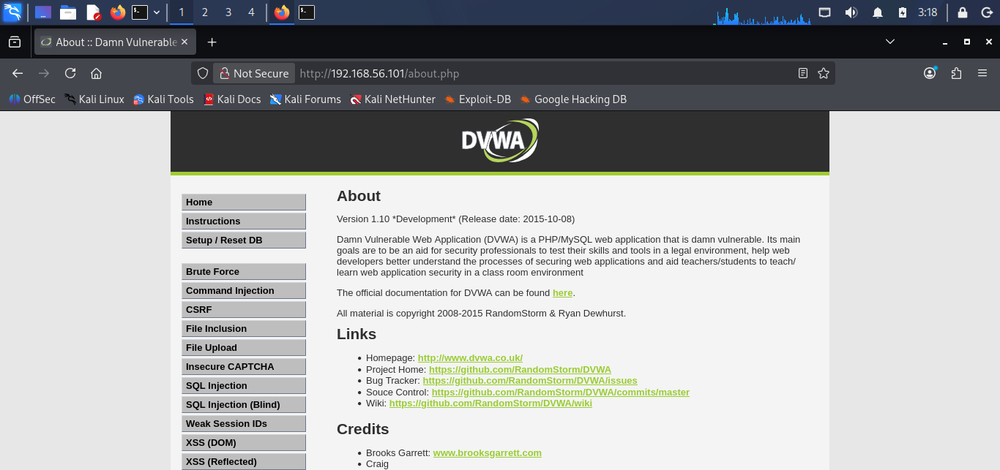

## 5. Methodology & Tools

Testing followed a two-phase approach per vulnerability class:

1. **Automated discovery** — OWASP ZAP active scan (authenticated, proxied through Firefox) to establish a baseline list of candidate vulnerabilities.
2. **Manual verification and deep-dive testing** — at all three DVWA security levels, to confirm exploitability with concrete evidence (screenshots, request/response captures), identify the exact root cause via DVWA's exposed source code, determine whether each level's added protections represent genuine remediation or merely narrow the exploitation technique required, and score CVSS v3.1 independently at each level.

Burp Suite was used to intercept and modify HTTP requests directly where the DVWA UI restricted input (dropdown-only fields, client-side length restrictions, spoofed Content-Type headers), since client-side restrictions do not constitute a server-side security control. Hydra and Burp Intruder were used for automated credential-guessing testing of the authentication module.

## 6. Automated Scan Summary (OWASP ZAP)

Scan type: active, authenticated (manual login + module walkthrough via proxy), security level Low. **Total alerts: 25** — 8 High, 5 Medium, 6 Low, 6 Informational.

**High-risk alerts:**

| Alert / CWE | Location |
|---|---|
| SQL Injection (CWE-89) | `/vulnerabilities/sqli/` |
| SQL Injection, Blind (CWE-89) | `/vulnerabilities/sqli_blind/` |
| XSS Reflected (CWE-79) | `/vulnerabilities/sqli/` (`id` param) |
| XSS Persistent (CWE-79) | `/vulnerabilities/xss_s/` |
| Path Traversal / LFI (CWE-22) | `/vulnerabilities/fi/?page=/etc/passwd` |
| OS Command Injection (CWE-78) | `/vulnerabilities/exec/` |

**Medium/Low alerts (configuration & headers):** absence of anti-CSRF tokens (CWE-352) · missing Content-Security-Policy header (CWE-693) · missing anti-clickjacking / X-Frame-Options header (CWE-1021) · directory browsing enabled (CWE-548) · cookie missing HttpOnly (CWE-1004) / SameSite (CWE-1275) · server version disclosure via Server header (CWE-497) · missing X-Content-Type-Options header (CWE-693).


## 7. Detailed Findings

### Finding 01: SQL Injection

CVSS v3.1: **8.8 High** (Low/Medium) / **5.4 Medium** (High) · OWASP: A03:2021 – Injection · CWE-89

| Level | Injection Succeeds? | Impact | CVSS |
|---|---|---|---|
| Low | Yes — full bypass | All 5 users disclosed | 8.8 High |
| Medium | Yes — numeric-context bypass | All 5 users disclosed | 8.8 High |
| High | Yes — capped by `LIMIT 1` | 1 user disclosed per request | 5.4 Medium |

**Root cause:** user input concatenated directly into SQL queries without parameterization at every level. Escaping (Medium) and re-quoting + row-limiting (High) narrow the technique or blast radius but never fix the underlying flaw.

```php
// Low
$query = "SELECT first_name, last_name FROM users WHERE user_id = '$id';";

// Medium
$id = mysqli_real_escape_string($GLOBALS["___mysqli_ston"], $id);
$query = "SELECT first_name, last_name FROM users WHERE user_id = $id;";
// Escaping targets quote characters only; $id is unquoted in the query,
// so a numeric payload (1 OR 1=1) needs no quotes and bypasses the mitigation entirely.

// High
$id = $_SESSION['id'];
$query = "SELECT first_name, last_name FROM users WHERE user_id = '$id' LIMIT 1;";
// Re-quoting closes the numeric bypass; LIMIT 1 reduces disclosure to one row
// per request. Root cause remains unaddressed.
```


**Remediation:** use parameterized queries/prepared statements exclusively — never concatenate user input into SQL strings. Apply least-privilege database account permissions for the application's DB user. Add a WAF rule set as defense-in-depth, not a primary control.

### Finding 02: Cross-Site Scripting (XSS) — Reflected

CVSS v3.1: **5.4 Medium** (all levels) · OWASP: A03:2021 – Injection · CWE-79

| Level | Working Payload | CVSS |
|---|---|---|
| Low | `<script>alert('XSS')</script>` | 5.4 Medium |
| Medium | `<sCrIpt>alert('XSS')</sCrIpt>` (case bypass) | 5.4 Medium |
| High | `` (alt-vector) | 5.4 Medium |

**Root cause:** user input echoed directly into HTML output without encoding at every level. Each level introduces a progressively broader blocklist targeting the literal word "script," but none apply output encoding — the CVSS score is unchanged across all three levels.

```php
echo '<pre>Hello ' . $_GET['name'] . '</pre>';
// Medium applies str_replace('<script>', '', $name) — case-sensitive,
// bypassed by <sCrIpt>. High applies preg_replace with the /i flag,
// closing the case bypass but still targeting only the word "script" —
// bypassed by non-script vectors like  or <svg onload>.
```

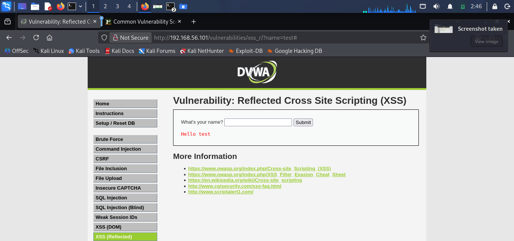
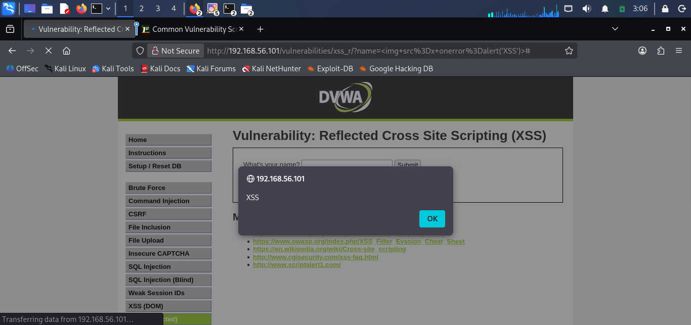

**Remediation:** apply context-appropriate output encoding (`htmlspecialchars` with `ENT_QUOTES`) at the point of output, not input-side blocklisting. Implement a strict Content-Security-Policy as defense-in-depth. Re-enable the browser's built-in XSS protections rather than explicitly disabling them via `X-XSS-Protection: 0`.

### Finding 03: Cross-Site Scripting (XSS) — Stored

CVSS v3.1: **6.4 Medium** (all levels, Name field) · OWASP: A03:2021 – Injection · CWE-79

| Level | Message Field | Name Field | CVSS |
|---|---|---|---|
| Low | Vulnerable | Vulnerable | 6.4 Medium |
| Medium | Remediated (`htmlspecialchars`) | Vulnerable — case bypass | 6.4 Medium |
| High | Remediated (`htmlspecialchars`) | Vulnerable — alt-vector bypass | 6.4 Medium |

**Root cause:** the Message field received proper output encoding from Medium onward and remained secure. The Name field on the identical form never received equivalent encoding at any level — a clear example of inconsistent control application across a single form. Client-side length restrictions on the Name field provided no real protection and were bypassed via Burp Suite.

```php
$message = strip_tags(addslashes($message));
$message = mysqli_real_escape_string(...);
$message = htmlspecialchars($message); // Message field: fixed from Medium onward

$name = str_replace('<script>', '', $name); // Name field: never encoded, weak blocklist only
```

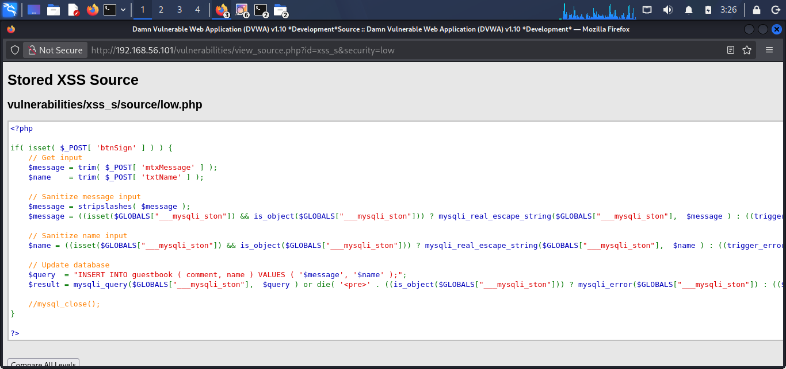
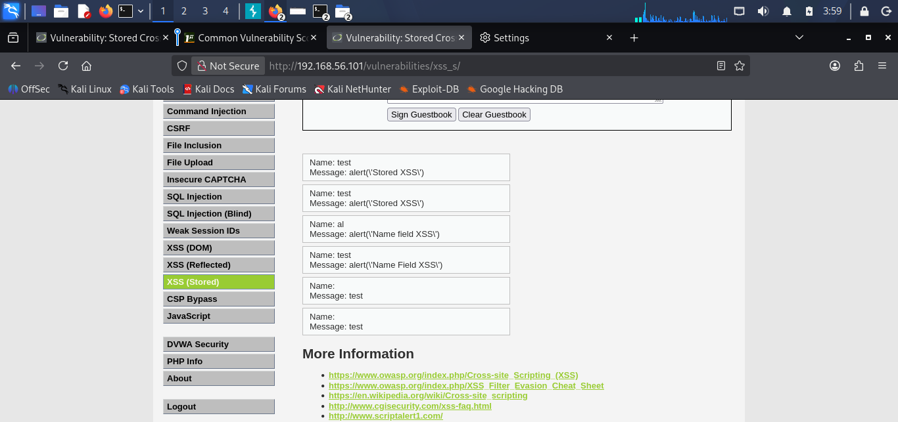
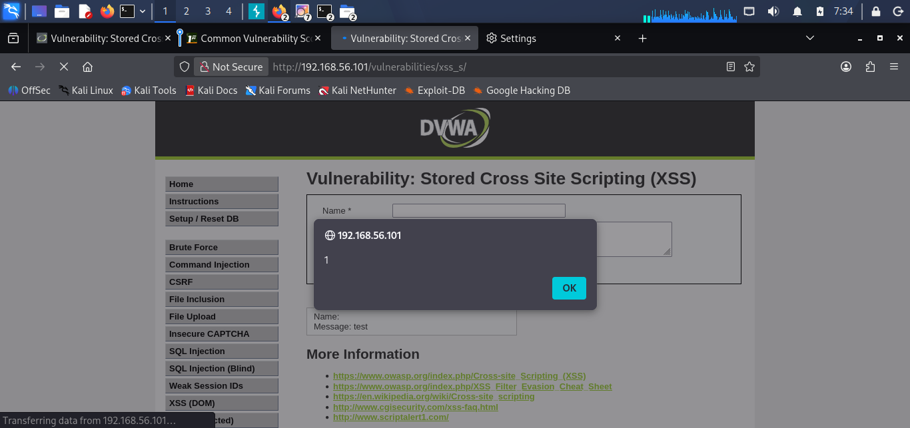

**Remediation:** apply `htmlspecialchars()` (or equivalent output encoding) consistently to every user-controlled field rendered on a page, not selectively. Treat client-side restrictions (`maxlength`, JS validation) as usability features only — never a substitute for server-side validation.

### Finding 04: OS Command Injection

CVSS v3.1: **9.9 Critical** · OWASP: A03:2021 – Injection · CWE-78

The Command Injection module accepts a user-supplied IP address and passes it directly to a system shell command (`ping`) via `shell_exec()`. At Low, no sanitization is applied at all. At Medium and High, the application attempts denylist-based filtering of shell metacharacters, but the filter is incomplete in both cases.

| Level | Working Payload | Result |
|---|---|---|
| Low | `127.0.0.1; whoami` | Full command chaining, unrestricted |
| Medium | `127.0.0.1 \| whoami` | `&&` and `;` blocked; pipe (`\|`) unfiltered |
| High | `127.0.0.1\|whoami` (bare pipe, no space) | Bypasses the `'\| '` (pipe+space) and `'\|\|'` blacklist entries |

```php
// Low — no filtering at all
$cmd = shell_exec('ping -c 4 ' . $target);

// Medium — blocks only '&&' and ';'
$substitutions = array('&&' => '', ';' => '');

// High — expanded blacklist, but '| ' requires a trailing space
$substitutions = array('&'=>'','; '=>'','| '=>'','-'=>'','$'=>'','('=>'',')'=>'','`'=>'','||'=>'');
```

All three levels rely on denylist substring removal instead of allowlist validation (e.g. a strict IPv4/hostname regex). Expanding the blacklist at High did not address the root cause, and produced a filter whose real-world behavior (both spaced and unspaced pipe payloads succeeded) was less predictable than its own source code suggested.

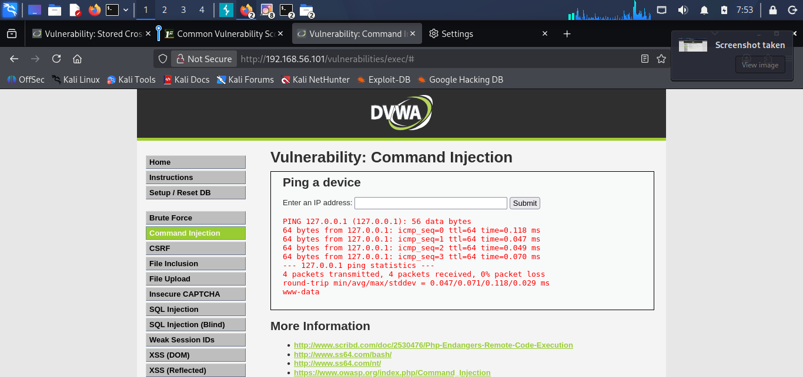
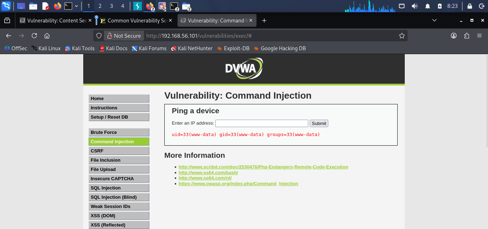

**Remediation:** replace denylist filtering with strict allowlist input validation (IPv4/IPv6/hostname regex). Avoid passing user input to shell commands entirely; use PHP's native networking functions instead of shelling out. Run the application under a least-privilege service account (already partially in place — `www-data`).

### Finding 05: Local File Inclusion (LFI)

CVSS v3.1: **7.5 High** · OWASP: A03:2021 – Injection · CWE-98 / CWE-22

The File Inclusion module passes a user-controlled `page` GET parameter directly into a filesystem read/include operation. Filtering was insufficient to prevent arbitrary file disclosure outside the web root at all three tested levels.

| Level | Working Payload | Mechanism |
|---|---|---|
| Low | `?page=../../../../../../etc/passwd` | No filtering of any kind |
| Medium | `?page=....//....//....//etc/passwd` | Single-pass, non-recursive `str_replace('../','')` |
| High | `?page=file:///etc/passwd` | `fnmatch("file*", $file)` only checks the prefix |

```php
// Medium — non-recursive, one substitution pass only
$file = str_replace(array("../",".. \\"), "", $file);

// High — checks only that the string STARTS WITH "file"
if( !fnmatch( "file*", $file ) && $file != "include.php" ) { ... }
```

At Medium, stripping `../` once from `....//` leaves a valid `../` sequence behind, restoring traversal. At High, the PHP stream wrapper `file://` itself begins with the substring `file`, satisfying the prefix check while still allowing an absolute filesystem path afterward.

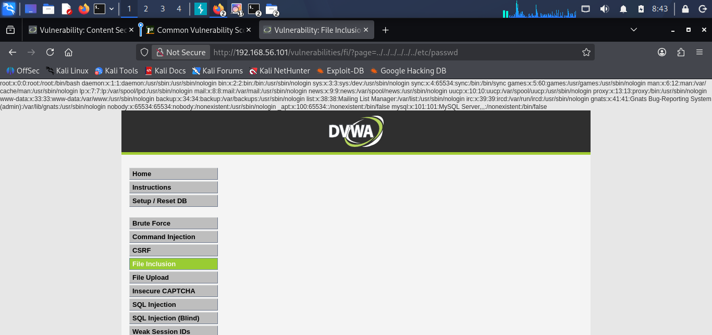
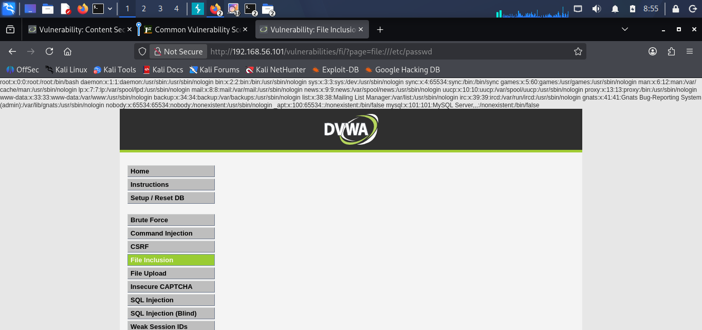

**Remediation:** replace denylist filtering with strict allowlist validation — compare the `page` parameter against a fixed, enumerated list of permitted values using exact string comparison. Avoid using user-controlled input in `include()`/`require()` statements entirely. Apply filesystem-level restrictions (`open_basedir`) to constrain PHP's file access.

### Finding 06: Cross-Site Request Forgery (CSRF)

CVSS v3.1: **8.8 High** (Low/Medium) / not exploitable (High) · OWASP: A01:2021 – Broken Access Control* · CWE-352

The CSRF module allows a logged-in user to change the admin password via a simple GET request. At Low and Medium, this request could be triggered by a page hosted entirely outside the application. At High, a genuine anti-CSRF token defeated every technique attempted.

| Level | Result | Technique |
|---|---|---|
| Low | Exploited | Direct URL paste, and a realistic clickable-link PoC on an unrelated attacker page |
| Medium | Exploited | Custom hostname (`192.168.56.101.attacker.local`) satisfying the flawed `stripos()` Referer substring check |
| High | Blocked | Anti-CSRF token (`checkToken`) correctly rejected both prior techniques |

```php
// Medium — substring match, not exact origin comparison
if( stripos( $_SERVER['HTTP_REFERER'], $_SERVER['SERVER_NAME'] ) !== false ) { ... }

// High — genuine, session-bound anti-CSRF token
checkToken( $_REQUEST['user_token'], $_SESSION['session_token'], 'index.php' );
```

Medium's Referer check uses `stripos()`, a substring search, rather than an exact match — any attacker-controlled hostname that merely contains the target's `SERVER_NAME` as a substring (e.g. `192.168.56.101.attacker.local`) satisfies the check. High correctly closes this gap using an unpredictable, per-session token validated server-side.

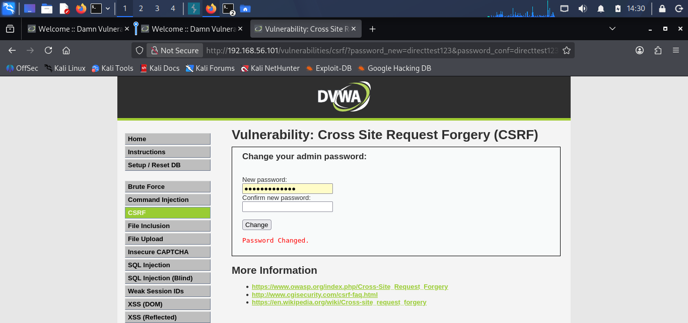
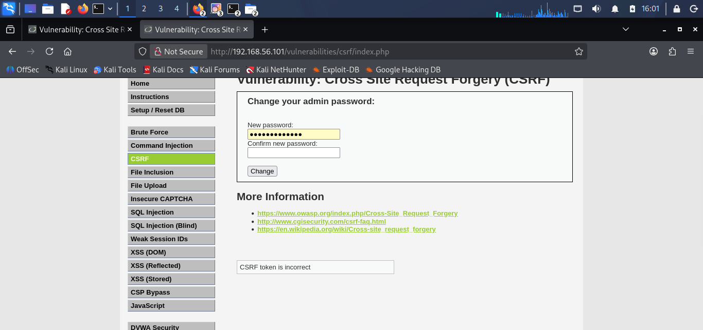

**Remediation:** implement a server-generated, per-session anti-CSRF token on all state-changing operations (as correctly implemented at High). Do not rely on Referer/Origin header validation as a primary defense; if used, require exact-match comparison, never a substring search. Apply the `SameSite` cookie attribute (`Strict` or `Lax`) as defense-in-depth.

*\* CSRF is not a standalone OWASP Top 10 2021 category (it was in 2017); it is discussed under A01: Broken Access Control.*

### Finding 07: Unrestricted File Upload

CVSS v3.1: **9.8 Critical** (Low/Medium) / not exploitable (High) · OWASP: A05:2021 – Security Misconfiguration · CWE-434

The File Upload module allows an authenticated user to upload a file to the server. At Low and Medium, insufficient validation allowed a PHP web shell to be uploaded and executed directly, resulting in full Remote Code Execution.

| Level | Result | Technique |
|---|---|---|
| Low | Full RCE confirmed | Direct upload of `shell.php`, no filtering present |
| Medium | Full RCE confirmed | Content-Type header spoofed (`image/jpeg`) via Burp Suite while keeping the `.php` extension |
| High | Blocked | Extension allowlist + size limit + `getimagesize()` all required together; polyglot-plus-rename bypass rejected |

```php
// High — three checks required together
if( ( strtolower($uploaded_ext) == "jpg" || "jpeg" || "png" ) &&
    ( $uploaded_size < 100000 ) &&
    getimagesize( $uploaded_tmp ) ) { ... }
```

Medium validates only the client-supplied Content-Type header — fully attacker-controlled and unrelated to the file's actual content. High combines extension allowlisting, a size limit, and genuine image-structure validation; a polyglot file (valid JPEG with appended PHP code) passed content validation but was still rejected once renamed to `.php`, since the extension check reads the filename directly and fails immediately for non-image extensions.


**Remediation:** never trust client-supplied Content-Type or filename/extension values for security decisions. Store uploaded files outside the web root, or in a location configured not to execute scripts. Rename uploaded files server-side to a randomly generated filename with a fixed, application-controlled extension. Re-encode/re-process uploaded images server-side to destroy any embedded non-image data (defeats polyglot techniques).

### Finding 08: Security Misconfiguration — Missing HTTP Security Headers

CVSS v3.1: **4.3 Medium** (representative) · OWASP: A05:2021 – Security Misconfiguration · CWE: multiple

Beyond the individually exploited vulnerabilities in Findings 01–07, ZAP and manual verification identified a cluster of application-wide misconfigurations. Individually lower severity, but collectively they weaken the application's overall posture and compound the impact of several other findings.

| Issue | CWE | Confirmed Impact |
|---|---|---|
| Missing Content-Security-Policy | CWE-693 | No defense-in-depth against XSS payload execution |
| Missing X-Frame-Options | CWE-1021 | Working clickjacking PoC — full app renders in an attacker's iframe |
| Missing X-Content-Type-Options | CWE-693 | MIME-sniffing risk in older browsers |
| Server version disclosure | CWE-497 | Apache/2.4.25 (Debian) exposed on every response |
| Directory Browsing enabled | CWE-548 | File/folder enumeration at `/dvwa/` |
| Cookie missing HttpOnly | CWE-1004 | Session cookie readable via JavaScript — compounds Finding 03 (Stored XSS) |
| Cookie missing SameSite | CWE-1275 | Session cookie sent cross-site — compounds Finding 06 (CSRF) |
| No HTTPS site-wide | — | Credentials and session tokens transmitted in plaintext |

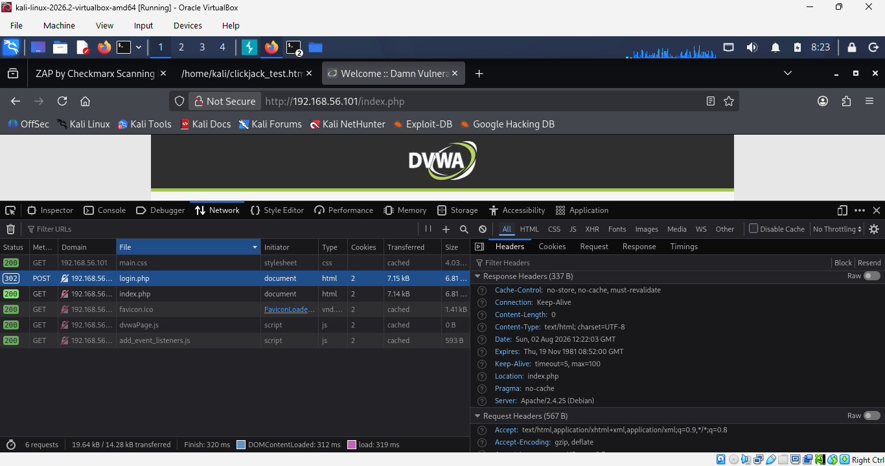
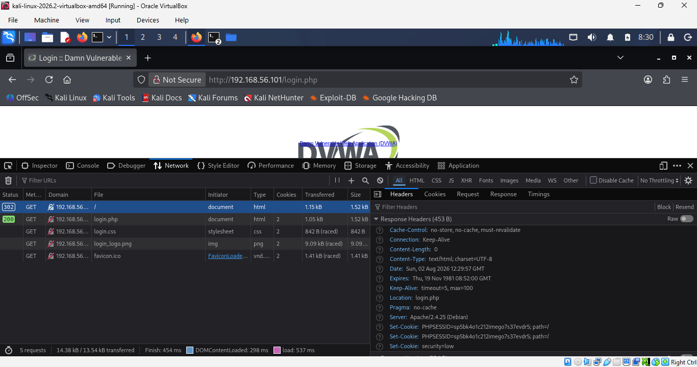

**Remediation:** implement a Content-Security-Policy including `frame-ancestors 'self'`. Set `X-Frame-Options: SAMEORIGIN` and `X-Content-Type-Options: nosniff` on all responses. Set `Secure`, `HttpOnly`, and `SameSite=Strict` on all session cookies. Suppress the Server header version string (`ServerTokens Prod`) and disable directory browsing (`Options -Indexes`). Enforce HTTPS site-wide, including HSTS.

### Finding 09: Insufficient Brute-Force Protection

CVSS v3.1: **5.3 Medium** · OWASP: A07:2021 – Identification and Authentication Failures · CWE-307

The Brute Force login module accepts unlimited repeated authentication attempts with no rate-limiting, account lockout, delay, or CAPTCHA challenge of any kind.

Manual test: six consecutive failed login attempts for user `admin` produced no observable change in application behavior. Automated test: a Burp Suite Intruder Sniper attack against the password parameter, using a 6-entry wordlist, completed all six requests with identical timing and no throttling or blocking observed.

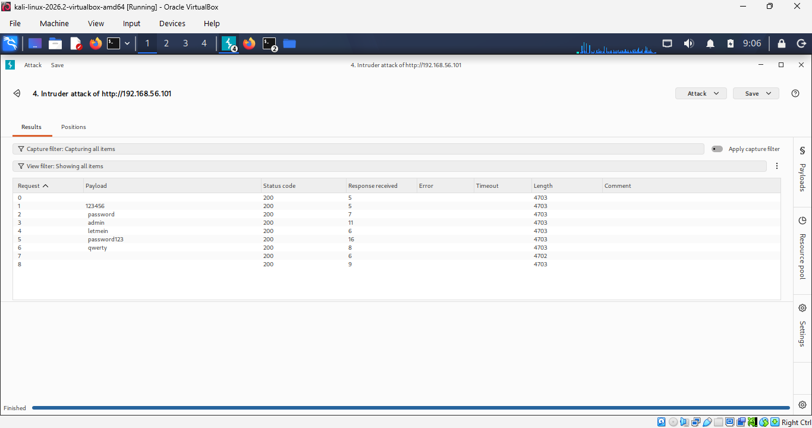

**Related observation — SQL Injection in the login query:**

```php
$user = $_GET['username'];
$query = "SELECT * FROM `users` WHERE user = '$user' AND password = '$pass';";
```

Source review identified the same unsanitized query-concatenation pattern documented in Finding 01, present here on the authentication endpoint. Not independently re-exploited, since Finding 01 already provides comprehensive evidence for this vulnerability class.

**Remediation:** implement account lockout after a defined number of failed attempts, with a time-based cooldown. Implement progressive delays (exponential backoff) between failed login attempts. Add a CAPTCHA challenge after a small number of failed attempts. Apply the same parameterized-query remediation from Finding 01 to this login query.

### Finding 10: Weak / Predictable Session IDs

CVSS v3.1: **7.5 High** · OWASP: A07:2021 – Identification and Authentication Failures · CWE-330 / CWE-384

The `dvwaSession` cookie is generated using a simple, server-side incrementing integer counter with no randomness, hashing, or cryptographic unpredictability. Any party who observes a single valid session ID can trivially predict every other value in current or near-future use.

```php
if (!isset($_SESSION['last_session_id'])) {
    $_SESSION['last_session_id'] = 0;
}
$_SESSION['last_session_id']++;
$cookie_value = $_SESSION['last_session_id'];
setcookie("dvwaSession", $cookie_value);
```

Live confirmation: three consecutive "Generate" requests produced the following `Set-Cookie` values, captured directly from HTTP response headers:

```
Set-Cookie: dvwaSession=7
Set-Cookie: dvwaSession=8
Set-Cookie: dvwaSession=9
```

Each generated session ID is exactly one greater than the previous, with no randomness of any kind — confirming the source-code analysis in live application behavior.

**Remediation:** generate session identifiers using a cryptographically secure random number generator (e.g. PHP's `random_bytes()`, 128+ bits of entropy). Never derive session tokens from predictable, sequential, or low-entropy sources. Rely on PHP's built-in, cryptographically secure session ID generator rather than custom logic.

## 8. Findings Summary Table

| # | Finding | OWASP 2021 | CWE | Severity |
|---|---|---|---|---|
| 01 | SQL Injection | A03 – Injection | CWE-89 | **Critical** |
| 02 | XSS (Reflected) | A03 – Injection | CWE-79 | High |
| 03 | XSS (Stored) | A03 – Injection | CWE-79 | High |
| 04 | OS Command Injection | A03 – Injection | CWE-78 | **Critical** |
| 05 | File Inclusion (LFI) | A03 – Injection | CWE-22 | High |
| 06 | CSRF | A01 – Broken Access Control | CWE-352 | High |
| 07 | Unrestricted File Upload | A05 – Security Misconfig. | CWE-434 | **Critical** |
| 08 | Security Misconfiguration | A05 – Security Misconfig. | Multiple | Medium |
| 09 | Insufficient Brute-Force Protection | A07 – Auth Failures | CWE-307 | Medium |
| 10 | Weak / Predictable Session IDs | A07 – Auth Failures | CWE-330 | High |

All 10 findings were fully tested across Low, Medium, and High security levels (where applicable) with evidence, root cause analysis, and CVSS v3.1 scoring documented in Section 7.

## 9. Risk Register

All ten findings consolidated with CVSS score, likelihood, overall risk rating, and treatment status. Full asset, threat, and vulnerability detail for each risk is in the corresponding Section 7 finding.

| Risk ID | Finding | CVSS v3.1 | Likelihood | Risk Rating | Treatment / Status |
|---|---|---|---|---|---|
| R-01 | SQL Injection | 9.8 Critical | High | **Critical** | Mitigate — Open |
| R-02 | Reflected XSS | 5.4 Medium | High | High | Mitigate — Open |
| R-03 | Stored XSS (Name field) | 6.4 Medium | High | High | Mitigate — Open |
| R-04 | Command Injection | 9.9 Critical | High | **Critical** | Mitigate — Open |
| R-05 | Local File Inclusion | 7.5 High | Medium | High | Mitigate — Open |
| R-06 | CSRF (Low/Medium) | 8.8 High | Medium | High | Mitigate — Open |
| R-07 | Unrestricted File Upload | 9.8 Critical | High | **Critical** | Mitigate — Open |
| R-08 | Security Misconfiguration | 4.3–5.3 Medium | High | Medium | Mitigate — Open |
| R-09 | Insufficient Brute-Force Protection | 5.3 Medium | High | Medium | Mitigate — Open |
| R-10 | Weak / Predictable Session IDs | 7.5 High | Medium | High | Mitigate — Open |

**Risk summary by rating:** Critical — 3 (R-01, R-04, R-07) · High — 5 (R-02, R-03, R-05, R-06, R-10) · Medium — 2 (R-08, R-09) · Low — 0.

**Highest-priority risks:**
- **R-01 (SQL Injection)** — full database read/write access, demonstrated across all three security levels.
- **R-04 (Command Injection)** — full arbitrary OS command execution as `www-data`, with working bypasses at all three levels.
- **R-07 (Unrestricted File Upload)** — full Remote Code Execution via an uploaded PHP web shell at Low and Medium; High-level controls tested and found effective.

## 10. Compliance Mapping

Each finding mapped to ISO/IEC 27001:2022, NIST Cybersecurity Framework (CSF) 2.0, and PCI DSS 4.0 control references, translating each technical finding into governance-relevant language.

| Finding | ISO/IEC 27001:2022 | NIST CSF 2.0 | PCI DSS 4.0 |
|---|---|---|---|
| FIND-01 SQL Injection | A.8.28 Secure coding | PR.PS-06 | Req. 6.2.4 |
| FIND-02 Reflected XSS | A.8.28 Secure coding | PR.PS-06 | Req. 6.2.4 |
| FIND-03 Stored XSS | A.8.28 Secure coding | PR.PS-06 | Req. 6.2.4 |
| FIND-04 Command Injection | A.8.28 Secure coding | PR.PS-06 | Req. 6.2.4 |
| FIND-05 Local File Inclusion | A.8.28 Secure coding | PR.PS-06 | Req. 6.2.4 |
| FIND-06 CSRF | A.8.28 Secure coding | PR.PS-06 | Req. 6.2.4 |
| FIND-07 File Upload | A.8.28 Secure coding | PR.PS-06 | Req. 6.2.4 |
| FIND-08 Security Misconfig. | A.8.9 / A.8.28 | PR.PS-01 / PR.PS-06 | Req. 2.2 / Req. 4.2 |
| FIND-09 Brute Force | A.8.5 Secure authentication | PR.AA-05 | Req. 8.3.4 |
| FIND-10 Weak Session IDs | A.8.5 Secure authentication | PR.AA-05 | Req. 8.3 |

**Compliance gap analysis:**

| Control Area | Status | Evidence |
|---|---|---|
| Input validation / injection prevention | Fail | FIND-01 – 07: SQL, XSS, OS command, LFI, CSRF, file upload vectors |
| Secure configuration management | Fail | FIND-08: missing security headers, directory browsing, verbose server banner |
| Data protection in transit | Fail | FIND-08: application served exclusively over HTTP, no TLS/HSTS |
| Secure authentication | Fail | FIND-09 (no lockout/rate-limiting), FIND-10 (predictable session tokens) |
| Logging and monitoring | Not assessed | Outside scope of this application-layer assessment |

**Framework-specific notes:**

*ISO/IEC 27001:2022* — seven of ten findings map to A.8.28 (Secure coding). A single systemic improvement — mandatory parameterized queries and output encoding libraries as an SSDLC standard — would address the root cause behind the majority of findings simultaneously.

*NIST CSF 2.0* — findings concentrate under the Protect (PR) function (PR.PS and PR.AA). No findings evaluated the Detect, Respond, or Recover functions, which require operational/process evidence outside this assessment's black-box, application-layer scope.

*PCI DSS 4.0* — every finding maps to Requirement 6 (secure systems and software). SQL Injection, Command Injection, and Unrestricted File Upload would constitute critical, immediately reportable findings in an actual PCI DSS Report on Compliance process.

## 11. Remediation Plan

| Priority | Finding(s) | Recommendation |
|---|---|---|
| **P1** | R-01, R-04, R-07 | Immediate remediation. Replace concatenated SQL with parameterized queries; eliminate `shell_exec()` on user input or apply strict allowlist validation; enforce combined extension/size/content validation plus re-encoding on all file uploads, matching the effective High-level control already demonstrated. |
| **P2** | R-02, R-03, R-05, R-06, R-10 | Short-term remediation. Apply context-appropriate output encoding consistently across every field (not selectively); replace path-traversal denylists with allowlist validation; replace Referer-based CSRF checks with per-session tokens (as already correctly implemented at High); generate session identifiers using a cryptographically secure random source. |
| **P3** | R-08, R-09 | Planned remediation, ideally delivered alongside P1/P2 work since these findings compound their impact. Add standard security headers, cookie flags, and TLS site-wide; add account lockout / rate-limiting / CAPTCHA to the login flow. |

## 12. Project Status

**Completed:**
- Phase 0: Scope, risk methodology, asset inventory, repo structure
- Phase 1: Environment setup and connectivity verification (two-VM lab)
- Phase 2: OWASP ZAP authenticated active scan (25 alerts, 8 High)
- Phase 2: All 10 findings fully tested across Low/Medium/High with evidence, root cause, CVSS, OWASP/CWE mapping
- Risk Register consolidating all 10 findings with CVSS, likelihood, and risk rating
- Compliance mapping across ISO 27001:2022, NIST CSF 2.0, and PCI DSS 4.0, including a gap analysis
- Remediation plan with priority tiers
- Executive Summary and final report assembly

**Suggested next steps:**
- Test the DVWA "Impossible" security level as a reference example of complete remediation across all findings
- Extend the assessment to logging/monitoring maturity for fuller NIST CSF 2.0 Detect/Respond/Recover coverage
